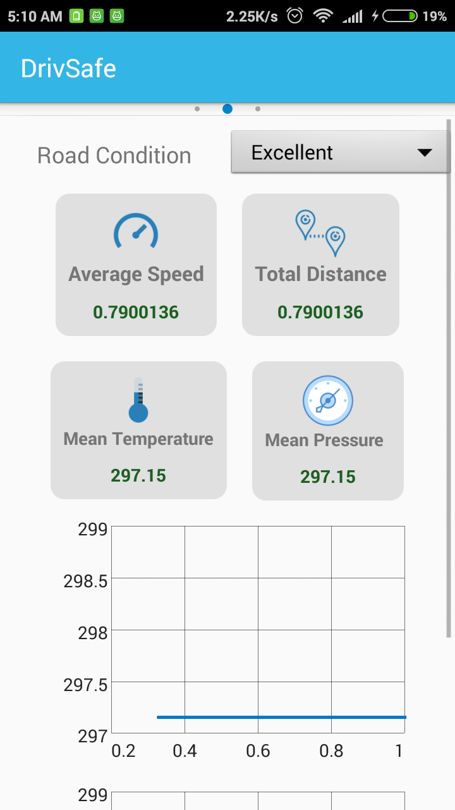

# DrivSafe

### Introduction

DrivSafe is an android app aimed at reducing the number of road casualties. Our tire sensors monitors your car tires non-stop around the clock.  You will get an alert as soon as the tire pressure and temperature drops below or rises above a certain pre-set level, even when the car ignition is switched off. This alert gives you time to get the tire fixed before you need to use it. You can also check detailed statistical analysis of tires like Speed vs. Temp, Speed vs. Pressure etc.
The sensors will be fitted with gps module, so you can track your car’s location anytime.

DrivSafe helps you to focus on the road. It would take care of all the incoming text messages. Our IVR technology will convert the incoming message into speech and read it out to you. You can speak out your reply as well.
While monitoring car tires, you can access below features of our app:

* Maps
* Incoming Calls and Messages
* Music Player
 
### Block Diagram

### Architecture / Working

Readings from temperature and pressure sensor goes to RaspberryPi through ArduinoUNO (which converts readings from analog to digital). Now RaspberryPi sends this reading to firebase server which in turn is fetched by android app and is shown using arc progress. The app analyse weather readings are in admissible range, if not an alert dialog box with find nearby garages is displayed 
### (Finding garages using Arduino UNO)

 |    

An algorithm based on accelerations, is applied to the mobile phones equipped with accelerometer and orientation sensor. The acceleration readings are usually provided by accelerometer in directions of x-, y-, and z-axis. For generality, it is assumed that the directions of x-, y-, and z-axis are decided by the orientation of the phone. As illustrated in Figure 1, the x-axis has positive direction toward the right side of the device; the y-axis has positive direction toward the top of the device and the z-axis has positive direction towards the front of the device. These values can be obtained via the orientation sensor. Longitudinal and lateral acceleration values are separately calculated and the result is matched with a predefined pattern to identify the abnormal driving patterns.

Accelerometer sensor is going to sense x, y & z direction value. If the vehicle is moving in normal position, then it will show x & y direction values. If vehicle is out of control, then it will follow x, y & z direction. Assuming that the smartphone is laid flat in the vehicle, with the screen of the phone facing the roof of the vehicle, the table below shows the phenomena associated with variation in each of the axis.

Axis |	Direction |	Typical Driving
--- | --- | ---
X	 | Left/Right	| Lane Change
Y |	Front/Rear |	Acceleration
Z |	Up/Down |	Road Anomalies

When the vehicle starts moving, axes’ positions also start changing and speed is determined using acceleration (Y axis) and type of road is determined using (Z axis).

Statistical analysis is done using type of road as filter and average speed, total distance, average temp and average pressure on that type of road is determined and speed vs. temperature and speed vs. pressure graph is formed.

### Detail Of Project

1. It is extremely important to ensure car tires are properly inflated for safety while driving. DrivSafe monitors your car tires non-stop around the clock and shows the tire pressure and temperature on your app screen.
2. The wear and tear (puncture) of tire happens gradually (pressure and temp changes). This app will alert you in advance whenever pressure and temperatures readings fall or go above pre-set level before any significant damage so that you can take care of it.
3. You can check out the detailed statistical analysis of tires and it will provide you with optimal speed range for the tire to be in good health by showing Speed vs. Temperature and Speed vs. Pressure Graph.
4. IVR technology will prevent driver to get distracted which is the root cause of many accidents. DrivSafe will convert all the messages to speech and driver can reply to them. App will also read the contact name on receiving any call.
5. Theft Control: You can track your car’s location anytime you want.
6. Simple UI based Mp3player to provide entertainment without attracting much attention of the driver.
7. Integrated Maps to guide you to your destination.
8. Increased MPG (Miles per Gallon). Proper tire inflation also leads to maximum miles per gallon for a vehicle. Driving with under-inflated tires can burn a lot more gasoline on any given trip. Good tire pressure maintenance will lead to cost savings and lower fuel consumption.
9. Road Condition DrivSafe will help in giving details about the roads on which your car rides and gives different graphical representation of every road condition (Excellent, Good, Poor).
10. Nearby Search the User can find any nearby resource it wants to find by typing its name.
11. DrivSafe is environmentally friendly, conserving precious resources.
- Tires wear longer saving valuable resources used to produce new tires.
- Properly inflated tires save fuel.
- Under inflated tires wear prematurely, adding to the landfill/disposal problem. 
- Assists in preventing dangerous debris on the road.
- Reduced rubber particulates in the air effecting air quality.

